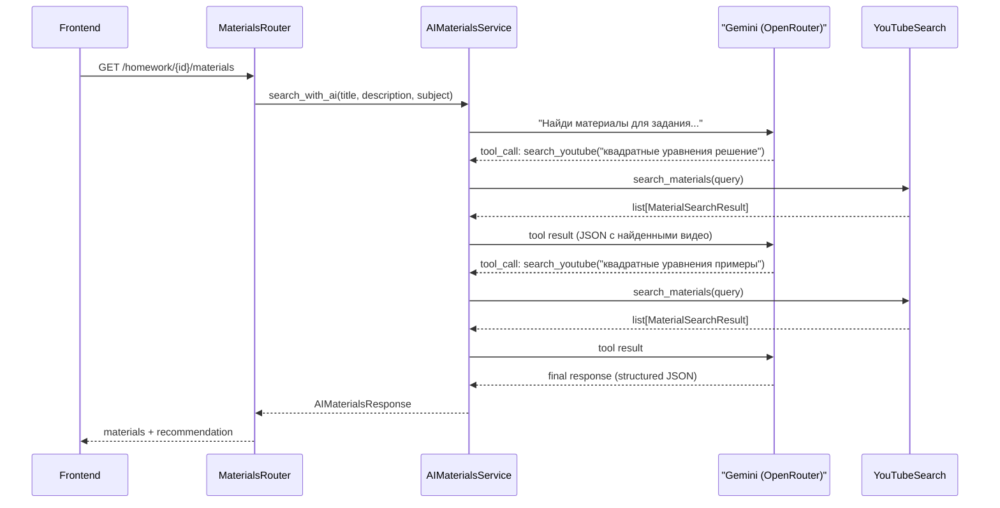

# AI Materials Search: Gemini + Tool Calling

Требование: Test-Driven Development (TDD)

Подход: сначала тесты, потом код. Задача выполняется строго в два этапа:

Этап 1 — Написание тестов (выполнить ПЕРВЫМ)

Перед написанием любого продуктового кода создай полное тестовое покрытие, описывающее ожидаемое поведение функционала:

Напиши тесты для всех эндпоинтов/компонентов/функций

Покрой все основные сценарии использования

Включи граничные случаи и обработку ошибок

Убедись, что тесты корректно описывают желаемое поведение

Этап 2 — Реализация (выполнить ВТОРЫМ)

Реализуй функционал задачи так, чтобы все написанные тесты проходили:

Запускай тесты после каждого значимого изменения

Не переходи к следующему шагу, пока все тесты не будут зелёными

При необходимости корректируй тесты, если требования изменились

## Текущее состояние

- [backend/app/services/materials_search.py](backend/app/services/materials_search.py) -- прямой вызов YouTube Data API v3, поиск по `"{subject} {query}"`, возврат до 5 результатов
- [backend/app/schemas/materials.py](backend/app/schemas/materials.py) -- `MaterialSearchResult(title, url, source, description, thumbnail_url)`
- Два эндпоинта: `GET /api/v1/materials/search` и `GET /api/v1/homework/{id}/materials`
- Frontend: форма поиска, карточки материалов, store с двумя методами
- `openrouter_api_key` отсутствует в [backend/app/core/config.py](backend/app/core/config.py)
- `openai` отсутствует в [backend/requirements.txt](backend/requirements.txt)

## Новая архитектура




Gemini работает как ReAct-агент: анализирует контекст задания, сам решает какие запросы сделать (1-3 вызова), получает результаты YouTube, и возвращает курированный ответ.

## Backend

### 1. Зависимости и конфигурация

- Добавить `openai` в [backend/requirements.txt](backend/requirements.txt)
- Добавить в `Settings` в [backend/app/core/config.py](backend/app/core/config.py):
  ```python
  openrouter_api_key: str = ""
  ```

### 2. Новая схема ответа: [backend/app/schemas/materials.py](backend/app/schemas/materials.py)

Добавить расширенную схему:

```python
class AIMaterialsResponse(BaseModel):
    materials: list[MaterialSearchResult]
    recommendation: str  # AI-сгенерированная рекомендация по подготовке
```

`recommendation` -- текст от Gemini с кратким планом подготовки и пояснением, почему выбраны эти материалы.

### 3. AI-сервис: `backend/app/services/ai_materials_search.py` (новый файл)

Основная логика -- ReAct-цикл с Gemini:

- **Клиент**: `OpenAI(base_url="https://openrouter.ai/api/v1", api_key=settings.openrouter_api_key)`
- **Модель**: `google/gemini-2.5-flash`
- **Tool definition**: один инструмент `search_youtube`:
  ```python
  tools = [{
      "type": "function",
      "function": {
          "name": "search_youtube",
          "description": "Поиск обучающих видео на YouTube по запросу",
          "parameters": {
              "type": "object",
              "properties": {
                  "query": {"type": "string", "description": "Поисковый запрос"}
              },
              "required": ["query"]
          }
      }
  }]
  ```
- **System prompt**: роль = образовательный помощник школьника, задача = найти лучшие видео для подготовки, использовать 1-3 поисковых запроса, в финальном ответе дать краткую рекомендацию по подготовке
- **ReAct-цикл** (max 4 итерации):
  1. Gemini получает контекст задания (предмет, тема, описание, дедлайн)
  2. Gemini вызывает `search_youtube` с оптимизированным запросом
  3. Выполняем реальный вызов `materials_search.search_materials()` (существующая функция)
  4. Возвращаем результаты Gemini как tool result
  5. Повторяем пока Gemini не выдаст финальный текстовый ответ
- **Финальный structured output**: после завершения tool-calling, делаем еще один вызов к Gemini с `response_format={"type": "json_object"}`, передаем все найденные материалы и просим вернуть JSON с полями `selected_urls` (выбранные URL из найденных) и `recommendation` (текст рекомендации)
- **Fallback**: если OpenRouter недоступен или `openrouter_api_key` пустой -- возвращаем обычные результаты YouTube без AI (текущее поведение), `recommendation = ""`

Ключевая функция:

```python
async def search_materials_with_ai(
    title: str,
    description: str | None,
    subject: str | None,
) -> AIMaterialsResponse:
```

### 4. Обновить эндпоинты

**[backend/app/routers/homework.py](backend/app/routers/homework.py)** -- эндпоинт `GET /homework/{id}/materials`:

- Изменить `response_model` на `AIMaterialsResponse`
- Вызывать `ai_materials_search.search_materials_with_ai(title, description, subject)` вместо прямого `search_materials()`
- Если AI-сервис бросает ошибку, fallback на текущий `search_materials()` с пустой рекомендацией

**[backend/app/routers/materials.py](backend/app/routers/materials.py)** -- эндпоинт `GET /materials/search`:

- Аналогично обновить `response_model` на `AIMaterialsResponse`
- Вызывать AI-поиск с переданными `query` и `subject`

### 5. Сохранить текущий `materials_search.py` без изменений

Существующий [backend/app/services/materials_search.py](backend/app/services/materials_search.py) остается как есть -- он используется как инструмент внутри AI-агента и как fallback.

## Frontend

### 6. Обновить типы: [frontend/types/materials.ts](frontend/types/materials.ts)

```typescript
export interface AIMaterialsResponse {
  materials: Material[];
  recommendation: string;
}
```

Добавить поле `description` в `Material` (сейчас отсутствует, но бэкенд его возвращает).

### 7. Обновить store: [frontend/store/materials.ts](frontend/store/materials.ts)

- Добавить поле `recommendation: string` в стейт
- Оба метода (`searchMaterials`, `fetchHomeworkMaterials`) парсят `AIMaterialsResponse` и сохраняют `recommendation`

### 8. Обновить UI

**[frontend/components/materials/materials-page-client.tsx](frontend/components/materials/materials-page-client.tsx)**:

- Достать `recommendation` из store
- Отобразить блок с AI-рекомендацией над списком материалов (если не пустой) -- карточка с иконкой `IconSparkles` или `IconBulb` и текстом рекомендации

**[frontend/components/materials/material-card.tsx](frontend/components/materials/material-card.tsx)**:

- Отобразить `description` если есть (краткое описание под заголовком)

## Ключевые решения

- **ReAct-цикл, а не одиночный запрос**: Gemini сам выбирает поисковые запросы, может делать 1-3 запроса в YouTube -- это дает более релевантные результаты, чем наивная конкатенация `"{subject} {query}"`
- **Fallback**: при ошибке AI или отсутствии ключа -- возвращается текущее поведение (только YouTube)
- **Существующий сервис не трогаем**: `materials_search.py` используется как tool внутри нового сервиса
- **Модель**: `google/gemini-2.5-flash` -- быстрая, дешевая, достаточна для подбора материалов
- **Max 4 итерации ReAct**: ограничение чтобы запрос не зависал

