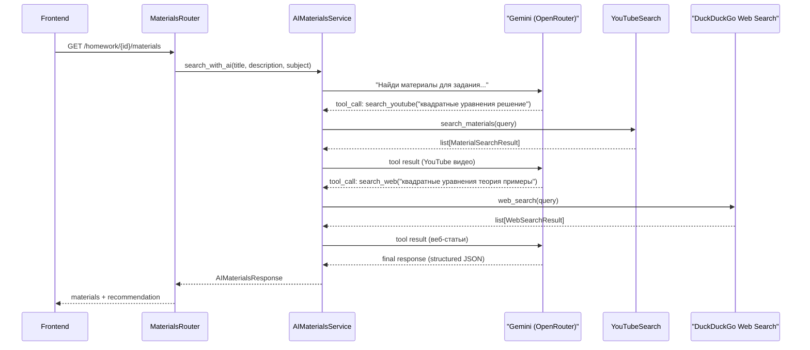

# AI Materials Search: Gemini + Tool Calling

Требование: Test-Driven Development (TDD)

Подход: сначала тесты, потом код. Задача выполняется строго в два этапа:

Этап 1 — Написание тестов (выполнить ПЕРВЫМ)

Перед написанием любого продуктового кода создай полное тестовое покрытие, описывающее ожидаемое поведение функционала:

Напиши тесты для всех эндпоинтов/компонентов/функций

Покрой все основные сценарии использования

Включи граничные случаи и обработку ошибок

Убедись, что тесты корректно описывают желаемое поведение

Этап 2 — Реализация (выполнить ВТОРЫМ)

Реализуй функционал задачи так, чтобы все написанные тесты проходили:

Запускай тесты после каждого значимого изменения

Не переходи к следующему шагу, пока все тесты не будут зелёными

При необходимости корректируй тесты, если требования изменились

## Текущее состояние

- [backend/app/services/materials_search.py](backend/app/services/materials_search.py) -- прямой вызов YouTube Data API v3, поиск по `"{subject} {query}"`, возврат до 5 результатов
- [backend/app/schemas/materials.py](backend/app/schemas/materials.py) -- `MaterialSearchResult(title, url, source, description, thumbnail_url)`
- Два эндпоинта: `GET /api/v1/materials/search` и `GET /api/v1/homework/{id}/materials`
- Frontend: форма поиска, карточки материалов, store с двумя методами
- `openrouter_api_key` отсутствует в [backend/app/core/config.py](backend/app/core/config.py)
- `openai` отсутствует в [backend/requirements.txt](backend/requirements.txt)

## Новая архитектура



Gemini работает как ReAct-агент с двумя инструментами: анализирует контекст задания, сам решает какие инструменты и запросы использовать (1-3 вызова), получает результаты из YouTube и веба, и возвращает курированный ответ.

## Backend

### 1. Зависимости и конфигурация

- Добавить `openai` и `duckduckgo-search` в [backend/requirements.txt](backend/requirements.txt)
- Добавить в `Settings` в [backend/app/core/config.py](backend/app/core/config.py):

```python
  openrouter_api_key: str = ""
```

### 2. Новая схема ответа: [backend/app/schemas/materials.py](backend/app/schemas/materials.py)

Добавить расширенную схему:

```python
class AIMaterialsResponse(BaseModel):
    materials: list[MaterialSearchResult]
    recommendation: str  # AI-сгенерированная рекомендация по подготовке
```

`recommendation` -- текст от Gemini с кратким планом подготовки и пояснением, почему выбраны эти материалы.

### 3. Веб-поиск: `backend/app/services/web_search.py` (новый файл)

Обертка над библиотекой `duckduckgo-search` (бесплатная, без API-ключа):

```python
async def search_web(query: str, max_results: int = 5) -> list[MaterialSearchResult]:
```

- Использует `DDGS().text(query, max_results=max_results)` через `run_in_threadpool` (библиотека синхронная)
- Каждый результат DuckDuckGo маппится в `MaterialSearchResult`:
  - `title` = title из результата
  - `url` = href/link из результата
  - `source` = `"article"`
  - `description` = body/snippet из результата
  - `thumbnail_url` = `None`
- Обработка ошибок: `WebSearchProviderError` (аналог `MaterialsProviderError`)

### 4. AI-сервис: `backend/app/services/ai_materials_search.py` (новый файл)

Основная логика -- ReAct-цикл с Gemini:

- **Клиент**: `OpenAI(base_url="https://openrouter.ai/api/v1", api_key=settings.openrouter_api_key)`
- **Модель**: `google/gemini-2.5-flash`
- **Tool definitions**: два инструмента -- `search_youtube` и `search_web`:

```python
tools = [
    {
        "type": "function",
        "function": {
            "name": "search_youtube",
            "description": "Поиск обучающих видео на YouTube по запросу",
            "parameters": {
                "type": "object",
                "properties": {
                    "query": {"type": "string", "description": "Поисковый запрос для YouTube"}
                },
                "required": ["query"]
            }
        }
    },
    {
        "type": "function",
        "function": {
            "name": "search_web",
            "description": "Поиск образовательных статей, учебников и сайтов в интернете",
            "parameters": {
                "type": "object",
                "properties": {
                    "query": {"type": "string", "description": "Поисковый запрос для веб-поиска"}
                },
                "required": ["query"]
            }
        }
    }
]
```

- **System prompt**: роль = образовательный помощник школьника; задача = найти лучшие видео И статьи/учебные материалы для подготовки; использовать оба инструмента (YouTube для видео, web для статей и теории); сделать 2-4 поисковых запроса; в финальном ответе дать краткую рекомендацию по подготовке
- **ReAct-цикл** (max 5 итераций):
  1. Gemini получает контекст задания (предмет, тема, описание, дедлайн)
  2. Gemini вызывает `search_youtube` и/или `search_web` с оптимизированными запросами
  3. Для `search_youtube` -- вызываем `materials_search.search_materials()` (существующая функция)
  4. Для `search_web` -- вызываем `web_search.search_web()` (новая функция)
  5. Возвращаем результаты Gemini как tool result
  6. Повторяем пока Gemini не выдаст финальный текстовый ответ
- **Финальный structured output**: после завершения tool-calling, делаем еще один вызов к Gemini с `response_format={"type": "json_object"}`, передаем все найденные материалы и просим вернуть JSON с полями `selected_urls` (выбранные URL из найденных) и `recommendation` (текст рекомендации)
- **Fallback**: если OpenRouter недоступен или `openrouter_api_key` пустой -- возвращаем обычные результаты YouTube без AI (текущее поведение), `recommendation = ""`

Ключевая функция:

```python
async def search_materials_with_ai(
    title: str,
    description: str | None,
    subject: str | None,
) -> AIMaterialsResponse:
```

### 5. Обновить эндпоинты

**[backend/app/routers/homework.py](backend/app/routers/homework.py)** -- эндпоинт `GET /homework/{id}/materials`:

- Изменить `response_model` на `AIMaterialsResponse`
- Вызывать `ai_materials_search.search_materials_with_ai(title, description, subject)` вместо прямого `search_materials()`
- Если AI-сервис бросает ошибку, fallback на текущий `search_materials()` с пустой рекомендацией

**[backend/app/routers/materials.py](backend/app/routers/materials.py)** -- эндпоинт `GET /materials/search`:

- Аналогично обновить `response_model` на `AIMaterialsResponse`
- Вызывать AI-поиск с переданными `query` и `subject`

### 6. Сохранить текущий `materials_search.py` без изменений

Существующий [backend/app/services/materials_search.py](backend/app/services/materials_search.py) остается как есть -- он используется как инструмент внутри AI-агента и как fallback.

## Frontend

### 7. Обновить типы: [frontend/types/materials.ts](frontend/types/materials.ts)

```typescript
export type MaterialSource = "youtube" | "article" | "website";

export interface Material {
  id: string;
  title: string;
  source: MaterialSource;
  url: string;
  description?: string;
  thumbnail?: string;
}

export interface AIMaterialsResponse {
  materials: Material[];
  recommendation: string;
}
```

- Расширить `MaterialSource` типом `"website"` (или оставить `"article"` для всех веб-результатов)
- Добавить поле `description` в `Material` (сейчас отсутствует, но бэкенд его возвращает)

### 8. Обновить store: [frontend/store/materials.ts](frontend/store/materials.ts)

- Добавить поле `recommendation: string` в стейт
- Оба метода (`searchMaterials`, `fetchHomeworkMaterials`) парсят `AIMaterialsResponse` и сохраняют `recommendation`

### 9. Обновить UI

**[frontend/components/materials/materials-page-client.tsx](frontend/components/materials/materials-page-client.tsx)**:

- Достать `recommendation` из store
- Отобразить блок с AI-рекомендацией над списком материалов (если не пустой) -- карточка с иконкой `IconSparkles` или `IconBulb` и текстом рекомендации

**[frontend/components/materials/material-card.tsx](frontend/components/materials/material-card.tsx)**:

- Отобразить `description` если есть (краткое описание под заголовком)
- Иконка `IconWorld` или `IconArticle` для веб-результатов (source = `"article"`), `IconBrandYoutube` для YouTube

## Ключевые решения

- **Два инструмента**: `search_youtube` (видео) + `search_web` (статьи, учебники, теория) -- Gemini сам выбирает когда какой использовать
- **DuckDuckGo для веб-поиска**: бесплатный, без API-ключа, достаточный для хакатона; пакет `duckduckgo-search`
- **ReAct-цикл, а не одиночный запрос**: Gemini сам выбирает поисковые запросы, может делать 2-4 запроса через разные инструменты -- это дает более разнообразные и релевантные результаты
- **Fallback**: при ошибке AI или отсутствии ключа -- возвращается текущее поведение (только YouTube)
- **Существующий сервис не трогаем**: `materials_search.py` используется как tool внутри нового сервиса
- **Модель**: `google/gemini-2.5-flash` -- быстрая, дешевая, достаточна для подбора материалов
- **Max 5 итераций ReAct**: ограничение чтобы запрос не зависал (2 инструмента = больше потенциальных вызовов)

