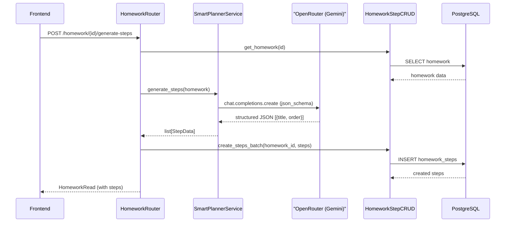

# Smart Planning: AI-разбиение задач на шаги

## Текущее состояние

Модель `HomeworkStep` и схема `HomeworkStepRead` уже существуют, `HomeworkRead` уже возвращает `steps`. Но нет:

- Сервиса для генерации шагов через AI
- CRUD-операций для создания/управления шагами
- Эндпоинтов для генерации и управления шагами
- UI для запуска генерации и интерактивной работы со степами

## Архитектура решения




## Backend

### 1. Зависимости и конфигурация

- Добавить `openai` в [requirements.txt](backend/requirements.txt)
- Добавить `openrouter_api_key: str = ""` в `Settings` в [backend/app/core/config.py](backend/app/core/config.py)

### 2. Сервис AI-генерации: `backend/app/services/smart_planner.py`

Новый сервис, использующий OpenAI-совместимый клиент через OpenRouter:

- Инициализация `OpenAI(base_url="https://openrouter.ai/api/v1", api_key=settings.openrouter_api_key)`
- Модель: `google/gemini-2.5-flash` (дешевая и быстрая)
- Метод `generate_steps(title, description, subject_name, deadline)` -> `list[StepData]`
- Structured output через `response_format` с `json_schema`:

```python
response_format = {
    "type": "json_schema",
    "json_schema": {
        "name": "homework_steps",
        "strict": True,
        "schema": {
            "type": "object",
            "properties": {
                "steps": {
                    "type": "array",
                    "items": {
                        "type": "object",
                        "properties": {
                            "title": {"type": "string"},
                            "order": {"type": "integer"}
                        },
                        "required": ["title", "order"],
                        "additionalProperties": False
                    }
                }
            },
            "required": ["steps"],
            "additionalProperties": False
        }
    }
}
```

- System prompt на русском: роль = помощник ученику, разбить задачу на 3-7 конкретных шагов, шаги должны быть понятны школьнику
- User message включает: предмет, заголовок, описание, дедлайн
- Обработка ошибок: кастомное исключение `PlannerServiceError`

### 3. CRUD для шагов: `backend/app/crud/homework_step.py`

- `create_steps_batch(db, homework_id, steps: list[StepData])` -- массовая вставка шагов
- `delete_steps_by_homework(db, homework_id)` -- удаление всех шагов задания (перед перегенерацией)
- `toggle_step(db, step_id)` -- переключение `is_completed` у конкретного шага

### 4. Схемы: расширить [backend/app/schemas/homework.py](backend/app/schemas/homework.py)

- `HomeworkStepCreate(BaseModel)`: `title: str`, `order: int`
- `GenerateStepsResponse(BaseModel)`: `steps: list[HomeworkStepRead]`, `count: int`

### 5. Эндпоинты: расширить [backend/app/routers/homework.py](backend/app/routers/homework.py)

- `POST /api/v1/homework/{homework_id}/generate-steps` -- вызывает AI, удаляет старые шаги (если есть), сохраняет новые, возвращает обновленный `HomeworkRead`
- `PATCH /api/v1/homework/{homework_id}/steps/{step_id}/toggle` -- переключает выполнение шага, возвращает `HomeworkRead`

## Frontend

### 6. Типы: обновить [frontend/types/homework.ts](frontend/types/homework.ts)

Тип `HomeworkStep` уже существует с полями `id`, `title`, `done`. Нужно убедиться, что маппинг `is_completed` -> `done` происходит корректно (возможно через алиас или трансформацию). Также проверить что `order` присутствует.

### 7. Store: обновить [frontend/store/homework.ts](frontend/store/homework.ts)

Добавить действия:

- `generateSteps(homeworkId: string)` -- POST к `/api/v1/homework/{id}/generate-steps`
- `toggleStep(homeworkId: string, stepId: string)` -- PATCH к `/api/v1/homework/{id}/steps/{stepId}/toggle`

### 8. UI: обновить [frontend/components/homework/homework-card.tsx](frontend/components/homework/homework-card.tsx)

- Добавить кнопку "Разбить на шаги" (с иконкой `IconListCheck` или `IconWand`) -- вызывает `generateSteps`
- Показывать loading-состояние при генерации
- Рендерить шаги как чеклист с чекбоксами, клик по чекбоксу -- `toggleStep`
- Если шаги уже есть, кнопка меняется на "Перегенерировать шаги"

## Ключевые решения

- **Модель Gemini**: `google/gemini-2.5-flash` -- баланс скорости и качества, дешевая
- **Structured output**: `json_schema` с `strict: True` гарантирует валидный JSON нужной структуры
- **Перегенерация**: при повторном вызове старые шаги удаляются и заменяются новыми
- **Количество шагов**: 3-7 шагов -- задается через system prompt

